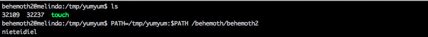

#Behemoth 2

This challenge was a bit interesting since it was not simple buffer overflow. 

After analyzing with gdb, I noticed that it called system, lstat, unlink and sleep.
Also, I realized that it touched a file. Since there was no checking for the acutal "touch" command, we can create a fake executable touch and add to the default path.

In my touch file:

