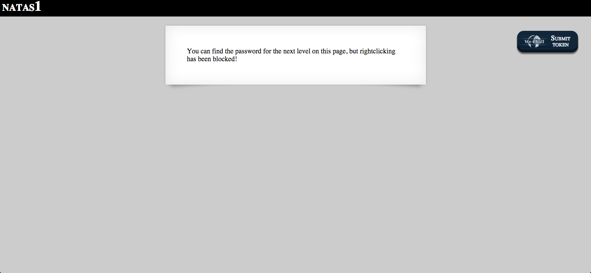
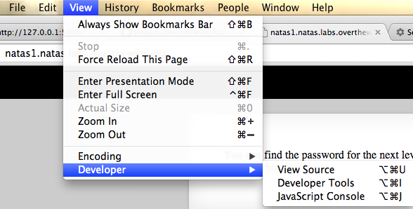
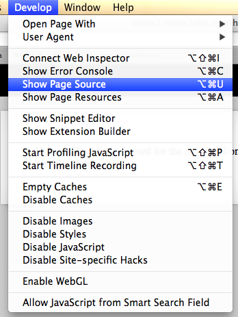
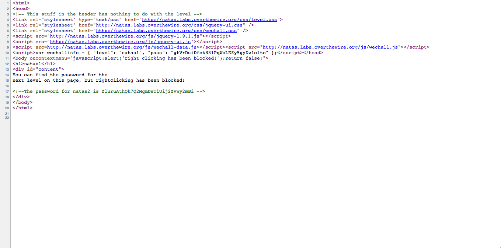

#Natas 1

This Time right clicking is disabled.

There are many ways to solve this:

In Safari, if you enable developer setting, you can do this:

In Chrome, you can access view source code until view:

you can use curl:

curl --user user:password url

There is the password for the next level:

