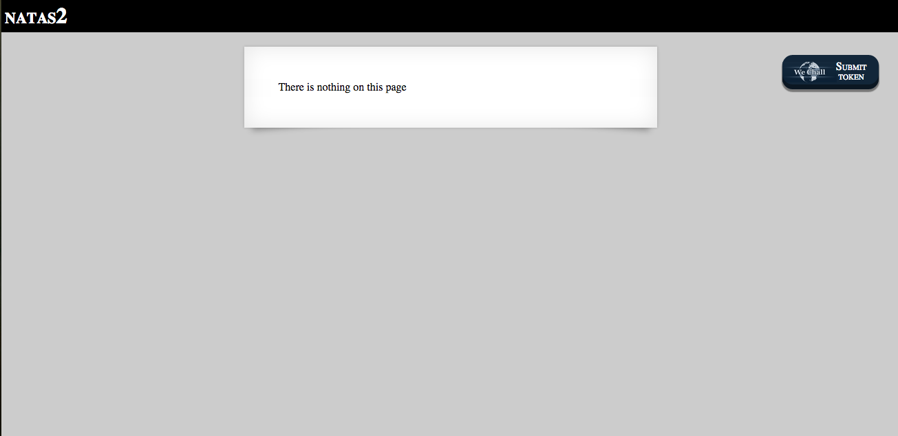
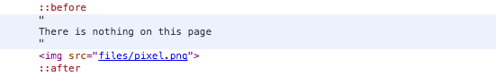
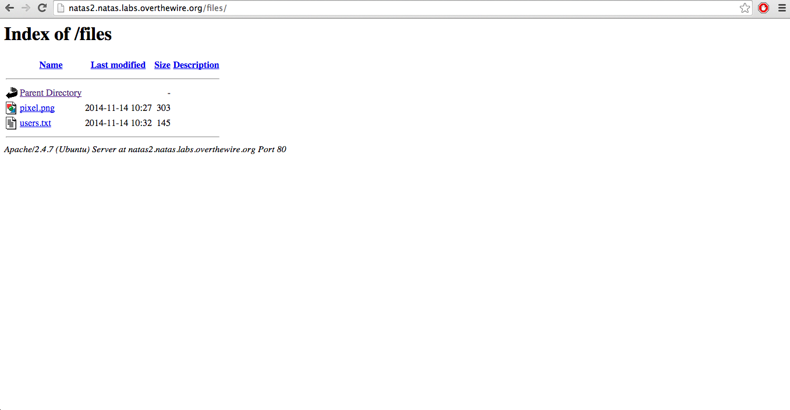
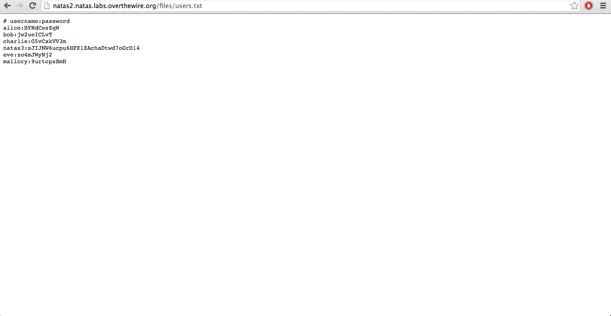

#Natas 2

Checeking the source code:

Hm..It seems like there is a hidden images and it tells you the image path.

Lets go to the directory and see if anything is there:

There are image and users.txt. Inside of users.txt file, there is our password:

