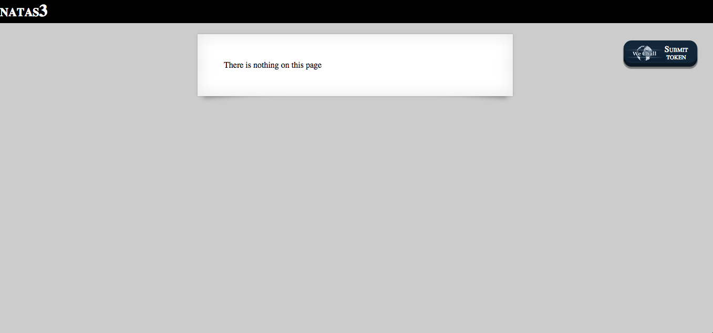
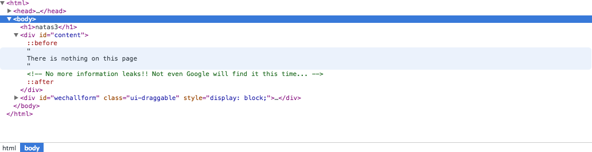
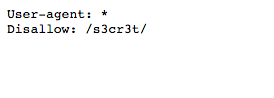

#Natas 3

Similar to last one, there is nothing on the page :(

Checking the soruce code:

It says "even google will not find this" which means it included "disallowed" facotr in robots txt.

For more information about robots.txt: <http://www.robotstxt.org/robotstxt.html>

When you go to /robots.txt, you will see /s3cr3t is disallowed:

In /s3cr3t, there is users.txt. 

Inside of that, there is our password:

